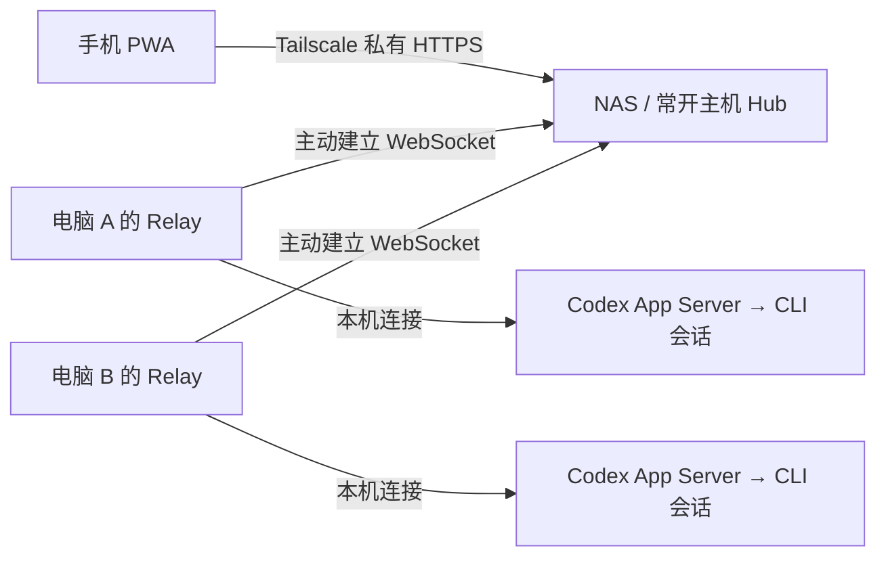

<p align="center"></p>

# Codexy

用手机查看多台电脑上的 Codex CLI 任务，并把下一轮 Prompt 发到指定会话。非官方社区项目。

主页直接显示正在推进、等待指令和需要处理的任务；进入会话后查看最近进展、上一条 Prompt，输入下一轮指令。支持 `/goal`、`/model`、思考强度，以及 Codex 提供数据时的 Context used 和 Weekly left。

## 推荐架构：NAS / 常开主机作为中枢



- **手机只连接一个地址**：登录中枢后汇总所有已登记电脑，不必逐台切换网址。
- **电脑负责执行**：每台工作电脑上的 Relay 主动连接中枢；中枢只汇集脱敏状态、转发指令，不运行模型或接管项目文件。
- **Prompt 定向投递**：手机确认目标电脑、会话与正文 → Hub 校验手机密钥 → 对应电脑连接 → Relay 校验会话 → App Server 向对应 CLI 提交。默认 Queue 等本轮结束；Steer 明确用于补充正在执行的回合。
- **事件更新，低频校验**：App Server 生命周期事件更新状态，Relay 和手机通过鉴权长轮询等待变化，约 25 秒续接；会话索引约 60 秒校验，排队指令由事件唤醒并每 30 秒兜底检查。手机回到前台重新同步。
- **中枢在线不代表电脑在线**：工作电脑必须开机、联网且 Relay 正常运行。电脑离线时不能接收指令；投递回执不明时不会自动重发，避免重复执行。

手机、中枢和工作电脑加入同一 Tailscale 网络，并允许访问中枢 TCP 8443。中枢的 8797 和电脑的 App Server 4510 保持本机监听，无需路由器端口映射或 Funnel。Tailscale Serve 提供私有 HTTPS，参见 [Serve 文档](https://tailscale.com/kb/1242/tailscale-serve)。

**当前边界**：Hub 模式支持手机前台查看和控制，尚未接入锁屏 Web Push；直连模式保留原有推送能力。一轮结束不等于整个目标完成。Context/Weekly 数据缺失时显示未知，不会把未知显示为 0%。Goal 和模型功能依赖目标电脑的 Codex 版本、登录方式及可用接口。

## 全流程部署

以下主流程适用于飞牛 NAS 或运行 Docker 的常开 Linux 主机。Windows、macOS、Linux 都可以作为工作电脑；其他系统作为中枢见下方“常开主机不用 Docker”。

### 1. 准备环境

| 位置 | 需要准备 |
| --- | --- |
| 手机 | Tailscale；iPhone 使用 Safari 添加 PWA 到主屏幕 |
| NAS / 中枢 | Tailscale 已登录、Docker Compose v2、Python 3、curl、SSH；一个持久化部署目录 |
| 工作电脑 / 构建电脑 | Git、Node.js 22.13+（或兼容的新版本）、npm；工作电脑另需安装并登录 Codex CLI |

先确认 `codex --version`、`node --version` 和 `docker compose version` 在各自设备可用。中枢不需要安装 Codex 或登录你的模型账号。在 Tailscale 管理台查看中枢的完整 MagicDNS 名称；下文 `my-hub.example-tailnet.ts.net`、`nas-user` 和 `NAS_IP` 均须替换为自己的值。常开中枢可按需关闭节点密钥过期，避免无人值守时断连，见 [密钥过期说明](https://tailscale.com/kb/1028/key-expiry)。

### 2. 在电脑构建中枢部署包

PowerShell、macOS 或 Linux 终端均可执行：

```sh
git clone https://github.com/SII-k7/Codexy.git
cd Codexy
npm ci
npm run hub:build
tar -czf output/codexy-hub.tgz -C output/nas/hub-package .
scp output/codexy-hub.tgz nas-user@NAS_IP:codexy-hub.tgz
```

`hub:build` 导出并验证手机页面，将运行代码、依赖和安装脚本放入 `output/nas/hub-package/`；不会生成或打包访问密钥，也不会切换这台电脑的直连页面配置。NAS 不需要安装 npm 或在 Docker 内下载 npm 依赖。

### 3. 在中枢解压并登记第一台电脑

SSH 登录中枢后执行。示例使用用户主目录；NAS 可把 `DEPLOY_DIR` 换成共享存储中的持久化目录。飞牛缺少用户主目录时先看 [飞牛专项排障](docs/FNOS_HUB_GUIDE.md)。

```sh
DEPLOY_DIR="$HOME/codexy-hub"
mkdir -p "$DEPLOY_DIR"
tar -xzf "$HOME/codexy-hub.tgz" -C "$DEPLOY_DIR"
cd "$DEPLOY_DIR"
python3 prepare-hub-config.py --root "$DEPLOY_DIR" \
  --hub-url https://my-hub.example-tailnet.ts.net:8443 \
  --host-id windows-main --label 'Windows 主力电脑'
```

以普通部署用户运行初始化，不要加 `sudo`。生成的文件：

| 文件 | 用途 |
| --- | --- |
| `data/config.json` | 手机密钥和各电脑密钥的 SHA-256 哈希、电脑 ID 与显示名称 |
| `access/phone-access.txt` | 手机登录中枢使用的原始密钥 |
| `access/windows-main-agent.json` | 只交给这台电脑的连接凭据 |

初始化遇到已有配置会停止，不覆盖密钥。`data/`、`access/` 目录权限为 700，文件为 600；这些文件应留在仓库外，不要提交或放进网页目录。

新部署首次创建 `.env`，让容器使用部署用户的 UID/GID 读取受保护的配置：

```sh
(umask 077; set -C; printf 'CODEXY_HUB_UID=%s\nCODEXY_HUB_GID=%s\n' "$(id -u)" "$(id -g)" > .env)
sudo sh ./install.sh
```

如果 `.env` 已存在，请编辑或补齐这两个值，保留原有配置。安装器检查现有容器名和 Tailscale 8443 路由，冲突时停止。容器仅发布 `127.0.0.1:8797`，设置自动重启，再通过 Tailscale Serve 的 HTTPS 8443 提供手机入口，不改 NAS 的 443 或其他应用。

初次启用 HTTPS 时若 Tailscale 提示前往管理台开启证书功能，按提示完成后重跑安装器。Docker 镜像拉取 401、飞牛特殊 Tailscale 路径等问题见 [飞牛指南](docs/FNOS_HUB_GUIDE.md)。

### 4. 每台工作电脑安装 Codexy

Windows PowerShell：

```powershell
irm https://raw.githubusercontent.com/SII-k7/Codexy/main/install.ps1 | iex
```

Ubuntu / macOS：

```sh
curl -fsSL https://raw.githubusercontent.com/SII-k7/Codexy/main/install.sh | sh
```

安装器配置本机 Relay、Codex 启动入口与后台服务。Windows 需要时会请求 UAC；Ubuntu 使用用户服务，macOS 使用 LaunchAgent。常开电脑仍需避免系统休眠；macOS 用户服务通常在登录后启动。

**完成一次本地配对**：在这台电脑的浏览器打开 `http://127.0.0.1:8797`，进入设置添加电脑，地址填同一地址，取一个名字。页面显示六位配对码后，在终端执行：

```sh
codexy pair 123456
```

把 `123456` 换成页面当前值。已有配对可沿用，无需重新注册。中枢连接器使用 Relay 当前有效的配对身份；未配对时电脑不会作为就绪设备上传状态。

### 5. 把电脑连接到中枢

通过 SCP 等可信方式，把 NAS 的 `access/windows-main-agent.json` 复制到**对应工作电脑**的用户私有目录。不要把 `phone-access.txt` 当作电脑密钥，也不要多台电脑共用一份 agent 文件。

找到安装器打印的源码目录，在其中 `.env.local` 添加或更新这一项，填电脑上的绝对路径：

```dotenv
CODEXY_HUB_AGENT_CONFIG=C:/Users/your-user/.codex/codexy/windows-main-agent.json
```

Linux/macOS 示例：

```dotenv
CODEXY_HUB_AGENT_CONFIG=/home/your-user/.codex/codexy/linux-main-agent.json
```

macOS 通常使用 `/Users/your-user/…`。安装默认源码位置：Windows `%LOCALAPPDATA%\Codexy\source`；Linux `~/.local/share/codexy/source`；macOS `~/Library/Application Support/Codexy/source`。自定义安装以实际路径为准。

重启 Relay 使配置生效：Linux/macOS 执行 `codexy service restart`；Windows 可重启电脑，登录后由 `Codexy Private PWA` 计划任务启动。若更新后台进程，须确认旧 Relay 已退出，单独停止计划任务不一定结束它的子进程。重启 Relay 会清空尚未投递的内存队列，请先检查待发送指令。

之后在项目目录使用：

```sh
codexy
```

这样启动的 CLI 接入可控 App Server。普通 `codex` 启动或历史会话可能被发现，但**能看到历史记录不代表它是可远控的活跃终端**；以会话控制状态为准。

### 6. 手机打开中枢并验收

1. 手机连接 Tailscale，Safari 打开 `https://my-hub.example-tailnet.ts.net:8443`，添加到主屏幕，再从主屏幕启动。
2. 输入 NAS `access/phone-access.txt` 文件中的密钥。Hub 登录不需要再输入电脑的六位配对码。
3. 确认目标电脑在线，打开该电脑上通过 `codexy` 启动的会话。
4. 先发一条容易核对的 Prompt；在确认页检查电脑、会话和正文，提交后核对手机回执与电脑 CLI 回复。
5. 测试电脑断网：手机应显示离线或失去实时状态；恢复后重新同步。不要仅凭旧的“正在推进”判断设备仍在运行。

会话里的 `/model` 打开模型和思考强度选择器；`/goal` 打开目标设置，可填写目标和可选 token 预算，并暂停或恢复已有目标。工具会确认操作，模型设置用于后续执行。Context used 根据最新一轮上下文 token 数计算近似百分比，Weekly left 根据账号周额度计算；没有对应数据时保留未知状态。

### 7. 添加第二台电脑 / 撤销旧电脑

在中枢部署目录执行，为每台电脑使用唯一 ID：

```sh
python3 prepare-hub-config.py --root "$PWD" --add-agent \
  --hub-url https://my-hub.example-tailnet.ts.net:8443 \
  --host-id mac-work --label 'Mac 工作机'
sudo docker compose restart hub
```

把 `access/mac-work-agent.json` 只复制给 Mac，重复步骤 4–5。手机的中枢密钥保持不变。不要同时运行多个登记命令。

撤销设备时，在 `data/config.json` 对应 `agents` 项加上 `"revoked": true`，重启 Hub；对应电脑将无法连接。若要轮换该电脑密钥，使用新的唯一 ID 登记后撤销旧 ID。手机密钥泄漏时需生成新随机密钥并替换 `ownerHash`，让手机重新登录；不要通过重跑初始化覆盖整套配置。

## 更新与维护

中枢：在源码目录 `git pull --ff-only`、`npm ci`、`npm run hub:build` 后重新打包上传。在中枢先备份 `release/`、`compose.yaml`、`install.sh`、`.env`、`data/` 和 `access/` 到私有位置，再将新包解压至同一部署目录，执行 `sudo sh ./install.sh`。**更新时不重新初始化密钥**；部署包不包含 `.env`、`data/`、`access/`。手机完全关闭再打开获取新页面。中枢与电脑 Relay 都应更新到同一版本以启用新增接口。

工作电脑：先处理完待发送队列。Windows 在源码目录 `git pull --ff-only` 后执行 `npm run update:apply`，需要时重启电脑确保旧 Relay 退出；Ubuntu/macOS 在源码目录执行 `sh ./install.sh --update`。本地修改会阻止安全更新，应先自行保存。

在中枢部署目录检查：

```sh
sudo docker compose ps
sudo docker compose logs --tail=80 hub
curl --fail http://127.0.0.1:8797/healthz
```

`healthz` 只说明 Hub HTTP 服务可用；完整链路还须看到电脑在线，并成功向测试会话发送 Prompt。电脑端 `codexy doctor` 检查本机安装与控制链路。显示未知时先检查电脑 Relay / Tailscale、配对和 agent 配置，不要用反复重发 Prompt 测连接。

## 常开主机不用 Docker

Hub 也能直接运行在装有 Node.js 的常开主机。完成源码依赖安装、`npm run hub:build`、Python 初始化后，将以下环境变量指向实际位置，再执行 `node hub/server.mjs`：

```dotenv
HOST=127.0.0.1
PORT=8797
CODEXY_HUB_CONFIG=/absolute/private-deploy/data/config.json
CODEXY_WEB_ROOT=/absolute/Codexy/output/hub-web
```

可通过 `node --env-file=/absolute/private-deploy/hub.env hub/server.mjs` 加载上述文件；Windows 路径使用 `C:/…`。另外用 `tailscale serve --bg --https=8443 http://127.0.0.1:8797` 提供私有 HTTPS，并用操作系统服务管理器托管 Node 进程、设置开机恢复。该原生方式没有自动安装服务的脚本，推荐 NAS/Linux 用户优先使用上面的 Docker 流程。

若中枢与工作 Relay 位于同一台电脑，两者不能同时占用 8797：原生 Hub 改用其他空闲本机端口，例如 8798，并把 Serve 的代理目标一并改为 8798。电脑 Relay 保持 8797。

## 可选：手机直接连接电脑

没有中枢也可使用。Windows 安装器支持配置电脑的私有 HTTPS；Ubuntu/macOS 安装命令加 `--tailscale`。手机打开电脑打印的私有网址，添加到主屏幕后，在设置中添加电脑并用 `codexy pair 六位码` 配对。

跨电脑汇总时，每台被访问电脑的 `.env.local` 需要显式设置 `CODEXY_ALLOWED_ORIGINS=手机工作台所在的完整HTTPS源地址`，随后重启 Relay。Hub 模式的手机只访问中枢同一来源，不需要为了它开放每台电脑的跨域访问。

## 数据与开发

手机会话标识使用哈希引用，不公开原始 thread ID 或项目绝对路径。摘要在本机脱敏，进入会话时按需读取；Prompt 历史最多保留每会话 10 条、24 小时。待发送的原始 Prompt 只在传输与内存队列中存在，终态或过期后清除；目标电脑收到后，Codex 自身仍会按其机制处理、保存对话或 Goal。Hub 的最新状态只保存在内存，不提供离线指令信箱。

部署密钥、`.env.local`、本地状态、截图、缓存与生成产物不应提交。手机登录凭据保存在当前浏览器的本地存储；只在自己的可信设备上使用，退出可清除当前登录。

```sh
npm ci
npm run check
npm run release:check
npm run hub:build
```

- 部署凭据回归测试另运行 `python3 scripts/test-hub-config.py`（Windows 可使用已安装的 `python`）。
- [架构说明与投递边界](docs/ARCHITECTURE_REVIEW.md)
- [飞牛 NAS 排障](docs/FNOS_HUB_GUIDE.md)
- [手机界面说明](docs/MOBILE_SIMPLE_UI.md)
- [iPhone 测试计划](docs/IPHONE_TEST_PLAN.md)

Codexy 与 OpenAI 没有隶属、授权或背书关系。开源协议：[MIT](LICENSE)。
